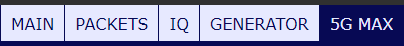
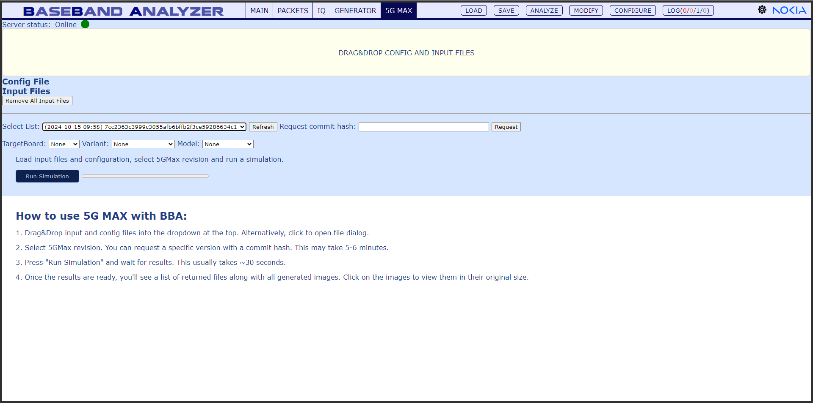

5GMax
==========

**How to use 5G MAX with BBA:**

1. Drag&Drop input and config files into the dropdown at the top. Alternatively, click to open file dialog.

2. Select 5GMax revision. You can request a specific version with a commit hash. This may take 5-6 minutes.

3. Press "Run Simulation" and wait for results. This usually takes ~30 seconds.

4. Once the results are ready, you'll see a list of returned files along with all generated images. Click on the images to view them in their original size.