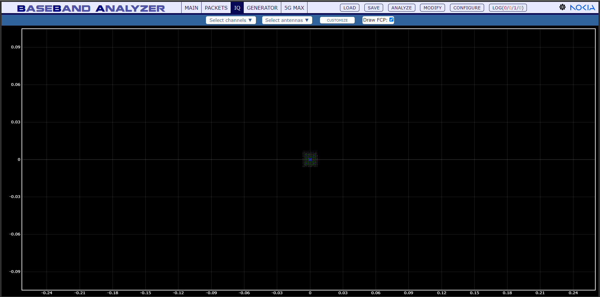
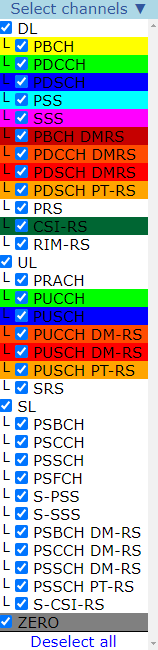
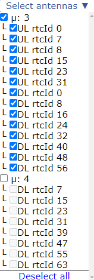
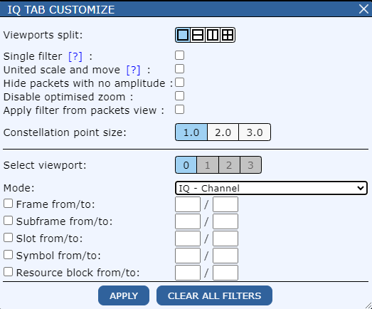
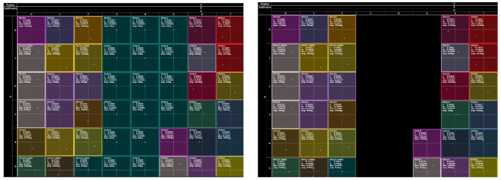
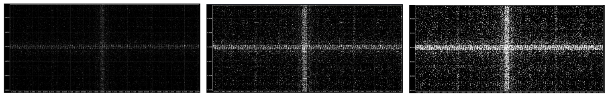
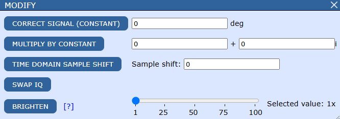

IQ
==========

IQ view 
----------

Select channels
-----------------

Use checkboxes to select desired channels.

**Deselect all:** click to uncheck all channels.

Select antennas
-----------------

Use checkboxes to select desired antennas.

**Deselect all:** click to uncheck all antennas​.

Customize
----------

Customize the IQ view to better suit your needs.

- **Viewport split:** customize the number (1, 2, 4) of viewports:
    .. image:: images/iq_viewports.png
        :width: 400

- **Single filter:** use the same filter for all viewports​

- **United scale and move:** all viewports can have the same scale and move parameters

- **Hide packets with no amplitude:**

- **Constellation point size: 1.0, 2.0, 3.0​**

- **Select viewport:** for each viewport you can choose different mode, antennas and channels​

- **Mode:** you can select: IQ, TimeIQ, Resource grid, FFT mode:

    .. image:: images/iq_modes.png
        :width: 300

- Check the checkboxes if you want to filter by frames, subframes, slots, symbols, resource blocks [from/to]​:

    .. image:: images/iq_filter.png
            :width: 500

After you're done click the **Apply** button​

You can also click the **Clear all filters** button to reset 

Modify
--------

- **Correct signal (constant)**: correct the signal by some number of degrees​

- **Multiply by constant**: multiply by a constant number​

- **Swap IQ**: swap I with Q​

- **Brighten**: it doesn't change the signal, but it makes it more visible in the IQ view

| See more: :ref:`iq_tips`
