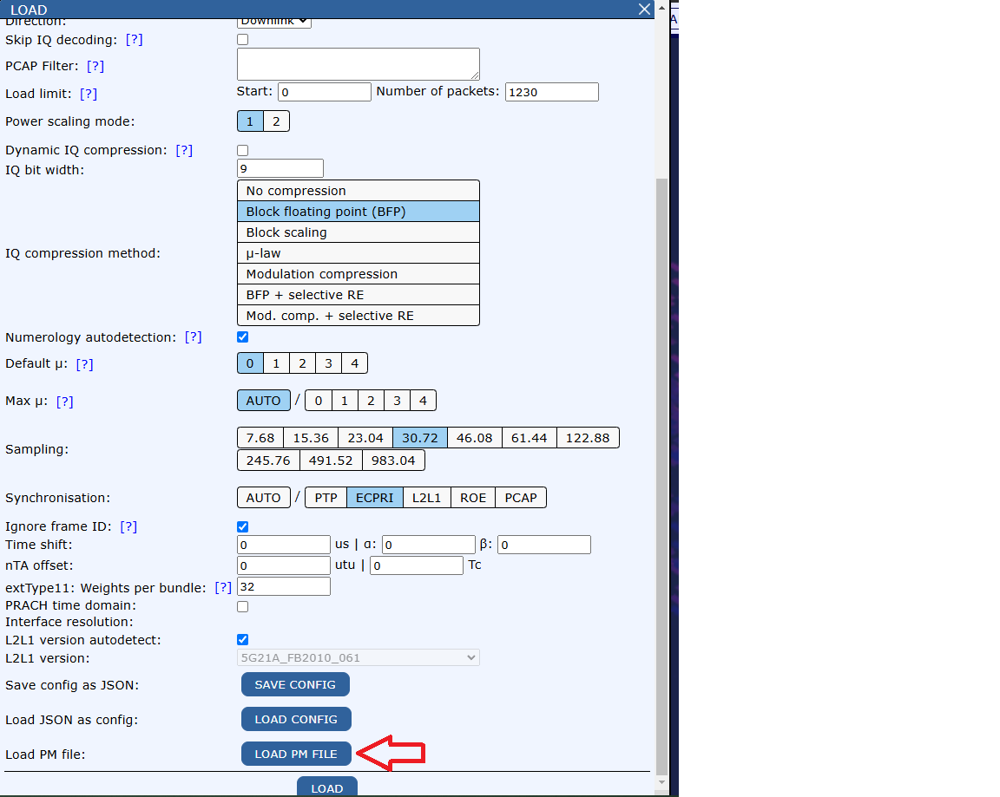
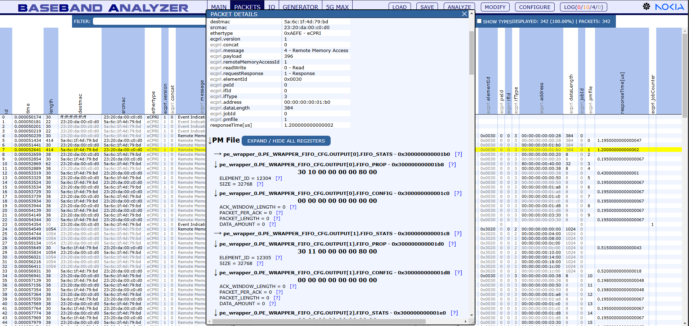
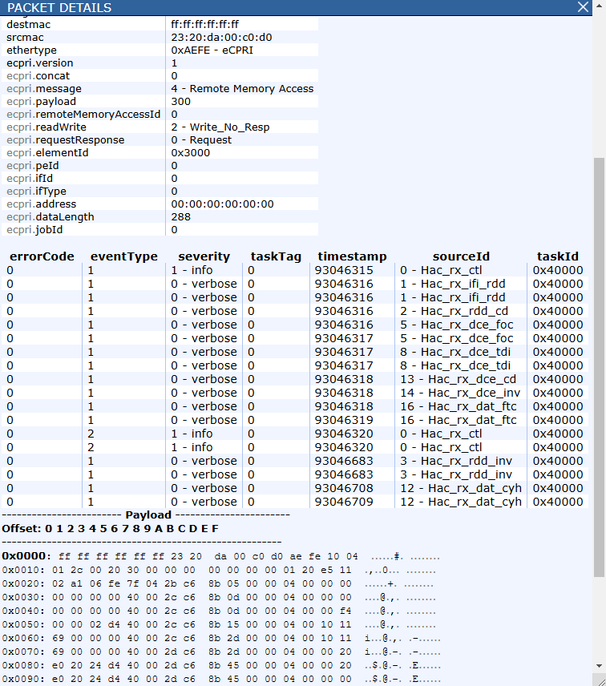

PPaaS
=========

BBA can we used as a tool for verification and analyses of PPaaS data.

Load and decode PM file
-------------------------

Additionally to loading pcap file, you can load and decode PM file. To do so click on "Load PM file" button and
select the PM file you want to load.

After loading PM file, you can click on packet in packets tab for which column **ecpri.pmfile** is not empty to open
**packet details** window.

In **packet details** window you will see section called **PM File** which can be expanded to see PM file content.

To do so you can use either arrows to open / close specific register or click on button **expand / hide all registers**
to open / close all registers at once.

For each register you can see:

- **register name** - built from PM file worktree names
- **register start address**
- **register raw payload**
- **register decoded fields** - their names, values and descriptions if available

Packets tab
--------------

In packets tab except decoding eCPRI messages 4, 6, 7 you can see new columns:

- **ecpri.peId**, **ecpri.ifId**, **ecpri.ifType** - which are extracted from **ecpri.elementId** column
- **ecpri.jobId** - extracted from **ecpri.address** for msg type 4 or from **ecpri.faults[0].additionalInfo** for msg type 7
- **responseTime[us]** - which calculates difference between response and request timestamps
- **ecpri.jobCounter** - which shows amount of started jobs in pipelining scenario, available for msg type 7

Analysis
------------

BBA provides several analysis related to PPaaS, which are available in **Analyze** dialog
(more details regarding each analysis can be found under related sections):

- :ref:`proto-plat-analysis`
- :ref:`pdp-prach-analysis`
- :ref:`hac-rx-analysis`

HAC-RX
------------

For HAC-RX in packets tab there are new columns decoded related to dynamic configuration
(packets with **ecpri.elementId** equal to 0x3020 - Task Descriptor).

Moreover there is SFN and slot decoding based on Task Descriptor.

For Debug Trace (**ecpri.elementId** equal to 0x3000) in **packet details** window there is table with decoded Debug Trace data.

RoE
------------

BBA supports usage of RoE as output for FPGA instead of eCPRI type 4.

There are new columns related to RoE decoding under PPaaS.

Analysis dedicated for PPaaS work the same way with RoE as with eCPRI type 4.
