Packets
==========

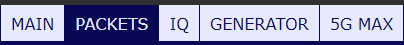

Packets table
----------------------

Interactive table displaying decoded data.

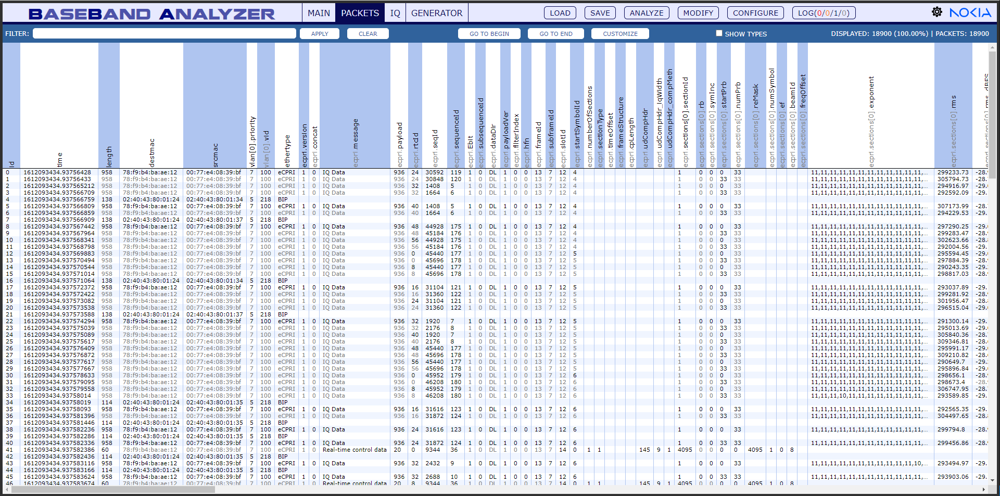

Show types
----------------------

Select the "Show types" checkbox to display the data types of the columns.

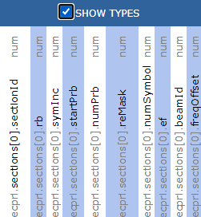

Data types:

- num - number

- str - string

- bool - boolean

- mix 

- arr - array

- dec - decimal

- obj - object

Customize
----------------------

Customize the table with packets.

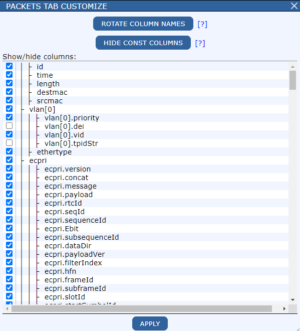

**Rotate column names:** Toggle between vertical and horizontal column name orientations. The horizontal orientation offers greater stability, making it easier to navigate while scrolling through the table.

**Hide const columns:** Hide columns where all values are identical. This feature works for primitive data types and arrays, but not for objects.

**Show/hide columns:** Adjust the visibility of columns by checking or unchecking their names, then apply the changes to update the table view.

Watch our tutorial video: `rotate column names <https://engage.cloud.microsoft/main/org/nokia.com/threads/eyJfdHlwZSI6IlRocmVhZCIsImlkIjoiMjkyOTA4MjEyNDE0MDU0NCJ9?trk_copy_link=V2>`_

Compare
---------------

You can mark up to 4 packets with ctrl + left mouse key and click **compare** to open the comparison dialog.

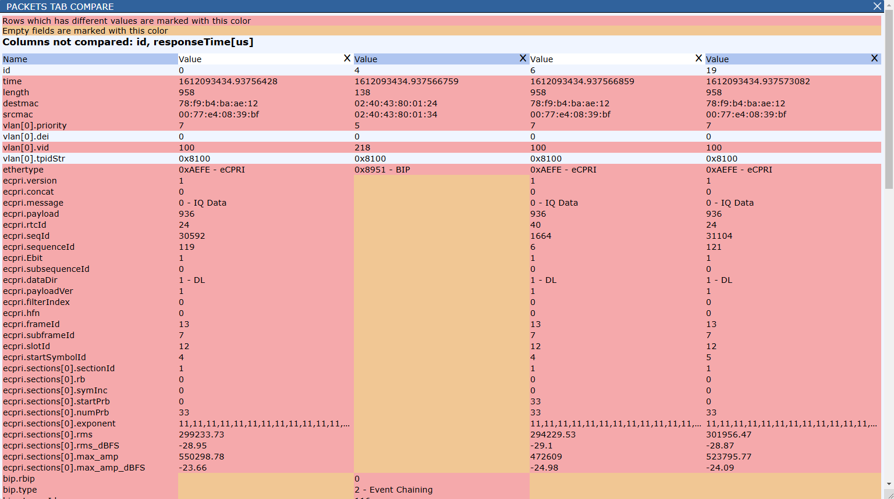

In the upper part of the window you can see some sort of legend. It shows how differences and empty fields are marked in the table.
It also shows which columns are not compared.

Below this information you can see the table with compared packets.

You can delete packets from the comparison by clicking the **x** button in the upper right corner of the packet's  header cell.

Filter
------------

To filter the data enter: @columnName == value e.g.  @ecpri.message == 0 and click **apply​**.

To clear all the filters click **clear** - the number of displayed packets will return to 100%​.

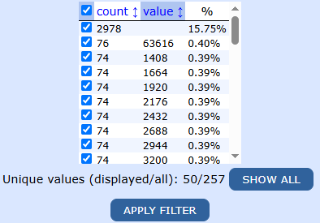

You can also filter data in the **Column details** dialog by checking or unchecking the checkboxes next to specific values.

You can use regular expressions in filter. It could help you with filtering multiple grands or sections. For example instead of creating filter: ``@ecpri.sections[0].startPrb == 0 || @ecpri.sections[1].startPrb == 0 || @ecpri.sections[2].startPrb == 0 || @ecpri.sections[3].startPrb == 0...``

You could just type ``new RegExp('startPrb').some((x) => x == 0)`` - this will filter any packets that have startPrb equal to 0 in any column with name that contains ``startPrb`` 

Constructor ``new RegExp()`` returns an array - you can use it just like you use array in JavaScript (most usefull functions here will be ``some`` and ``every``).

Column details
---------------

Click the column name to open the column details dialog.

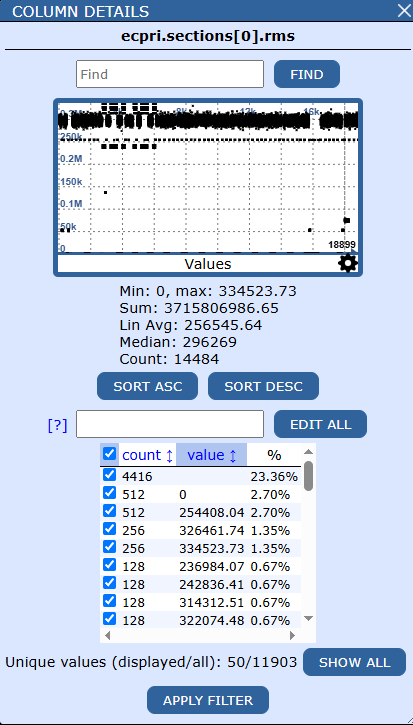

- Find: Enter a value to search for it.

- Statistics: min, max, sum, avg, median, count​.

- Sort asc/desc: sort the column in ascending or descending order.

- Filter: 

    - Check/uncheck checkboxes to show/hide values​;

    - Sort by count and value​;

    - Show all: show all unique values in selected column​;

    - Apply filter to add filter to existing filter conditions.

Graph
^^^^^^

Graph visualizing the values. Try scrolling to zoom in and moving it to explore the details.

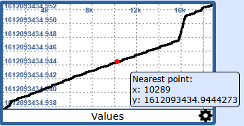

- **Hover over** the graph to view the closest value.

- **Double-click** on the graph to navigate to the corresponding packet in packet table.

- **Click** on settings icon to open the graph options dialog.

    .. image:: images/graph_options.png
        :width: 300

Edit all
^^^^^^^^^

Override all the values in the column. It will only change the values that are currently selected.​

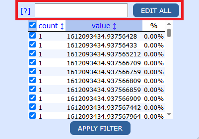

.. code-block:: text

    Examples: ​

    - value = "c0:41:21:19:e4:d9"​

    - value += 3​

    - value = parseInt(value*2/13)

Time format
^^^^^^^^^^^^

Click on the column **time** to open **column details** dialog.

​Click on the buttons to change the time format between: raw, start, time, date, delay.

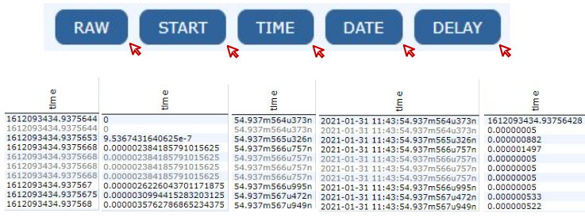

Cell context menu
------------------

Right-click a cell to open the cell context menu. You can filter or highlight rows with matching values. You can also hide the selected column.

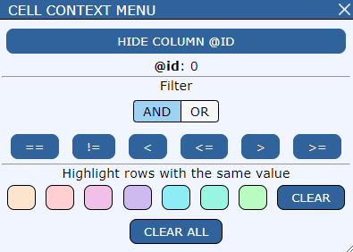

Synchronization
------------------

Synchronization is a means of observing relative time differences between packets.
Every time data is loaded through the "Load" dialog, the timing values are being calculated, for every packet.

The results of Synchronization actions are columns:
 - PtpTime - Value for a source of timing data (Based on Synchronization settings)
 - PtpFrame - Frame number calculated baed on PtpTime
 - eCpriDelayPtpUs - Delay between packet's symbol and PtpTime in microseconds
 - dt_us - eCpriDelayPtpUs alias for packets containing packets with L2L1 messages

Synchronization results are dependent on:
 - Synchronization mode
 - Max numerology, present in loaded data (eCpri packets)
 - Sampling (RoE packets)
 - ntaOffset,
 - Time shift
 - "Ignore FrameID" setting

Synchronization mode
^^^^^^^^^^^^

Syncronization mode defines the source of timing data. It can be set to:
 - PTP - uses PTP packets with messageIds 0 and 8 and uses "originalTimestampS" and "originalTimestampNs" fields as source of data,
 - eCpri - creates a timestamp from eCpri.frameId/slotId/symbolId,
 - L2L1 - creates a timestamp from l2l1.sfn/slotId fields,
 - RoE - creates a timestamp from p/q_counter fields,
 - PCAP - uses "PCAP" timestamp. A copy of "time" column,
 - AUTO - will try to detect the mode based on data present in the file, in order of modes listed. For example, BBA will look for PTP packets. If none are found, it will start looking for eCpri pacets etc...

**What happens when not all packets contain selected timing data?**

Before filling in the "PtpTime" column, BBA performs linear regression on data present.
With "time" field as an input, "PtpTime" can now be calculated.
PtpTime = F(time) = a * time + b,\
where a and b are calculated based on packets that contain timing data (these values can be inspected in the "Log" dialog window).

As a result, based on select few packets, BBA can generate corrected timing values for all packets.

PtpFrame and eCpriDelayPtpUs fields
^^^^^^^^^^^^
Here are the steps performed when calculating PtpFrame and eCpriDelayPtpUs fields:

We first convert PtpTime to GPS time.
gpsTime = ConvertToGps(PtpTime); // Sometimes we convert from UTC (PCAP) and other times from TAI (PTP)

We divide by frame's period in seconds to convert to 'frame' units.
const FramePeriodInSeconds = 0.01;
t = gpsTime / FramePeriodInSeconds;

Next, we apply modulo(maxFrameNumber) to t. For eCpri this value is 256. For L2L1 it's 1024.
t = t % MaxFrameNumber;

Finally, the 't' value is assigned to "PtpFrame" field and rounded to 4 decimal places.
**PtpFrame** = t.toFixed(4);

Now we calculate 'frame' value. 'frame' being symbol's frameId and position within said frame.
For eCpri:
frame = ecpri.frameId + ecpri.subframeId / 10 + symbol_start_in_sf(ecpri.slotId, max_u, ecpri.startSymbolId)/ 1228800;
where symbol_start_in_sf() is a helper function, that calculates symbol's position within a subframe
and max_u is the largest numerology present in the capture.
For RoE:
frame = packet.roe.q_counter + packet.roe.p_counter * time_per_p_counter_tick_in_frames;
where time_per_p_counter_tick_in_frames = 3200 / (sampling * 1000000),
where sampling is an option selected in the Load dialog.
For L2L1:
frame = packet.l2l1.sfn + packet.l2l1.slot / (1 << ecpri_maxU) * 0.1;

Now we get a difference between 't' and the frame's position.
delay = t - frame;

We create a "correction" value based on alpha and beta values, specified in the 'Load' dialog. (default: 0)
correction = timeShift_beta * 10000 + timeShift_alfa / 1228.8;
Reference: O-RAN-WG4.CUS.0-v07.00: 9.7.2

"Ignore frame Id" is a setting for packets with invalid frameId values.
It limits the time relations up to a frame boundary (10ms) (default: checked).

if ( ignoreFrameId ) {\
    delay = delay % 2\
    if (delay > 1) dt -= 2\
    if (delay < -1) dt += 2\
    correction = correction % 20000\
    if (correction > 10000) correction -= 20000\
    if (correction < -10000) correction += 20000\
}\

Earlier we changed units from seconds to 'frame' by dividing gpsTime by framePeriodInSeconds. Now we want seconds again so we reverse this operation.
delayS = delay * FramePeriodInSeconds;
delayUs = delayS * 1e6; // Move from seconds to useconds

We can now apply the correction.
delayUs = delayUs - correction;

And lastly, for UpLink packets, we apply ttaOffset based on value specified in the 'Load' dialog (default values set based on numerology);
if(UpLink) delayUs = delayUs + TtaOffset;
where TtaOffset = ntaOffset_tc / 1966.08;
Reference: O-RAN-WG4.CUS.0-v07.00: 9.7.2, Table 9-10
For inspection, selecting different numerologies in the "Load" dialog will immediately update the nTa offset values.

**eCpriDelayPtpUs** = delayUs;

