Analyze
=========

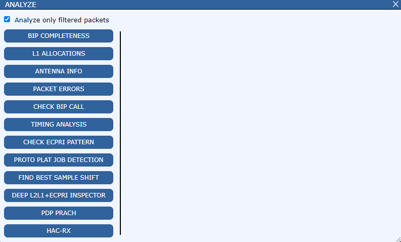

BIP completeness
----------------------

Algorithm checks whether BIP Event Sequence Number is continuous per BIP StreamId, per MAC Source.

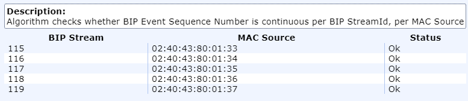

L1 allocations
----------------------

Algorithm checks if L1 allocations overlap or extend outside max PRB limit.
UlData:: PuschReceiveReq, PucchReceiveReq, SrsReceiveReq, PrachReceiveReq;
DlData:: PdschSendReq, PdcchSendReq, SsBlockSendReq, CsiRsSendReq.

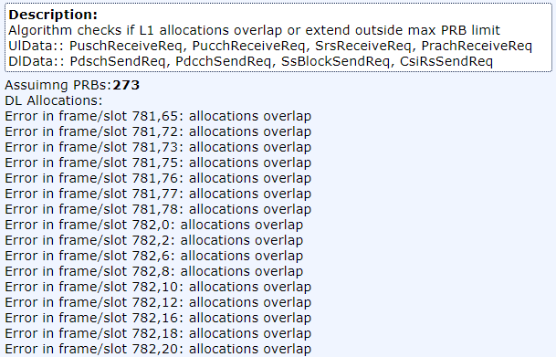

Antenna info
----------------------

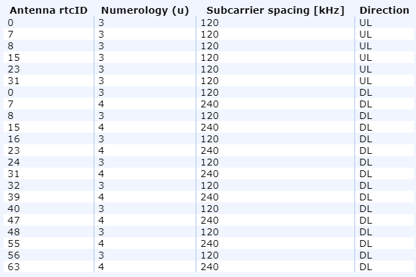

Packet errors
----------------------

Check BIP call
----------------------

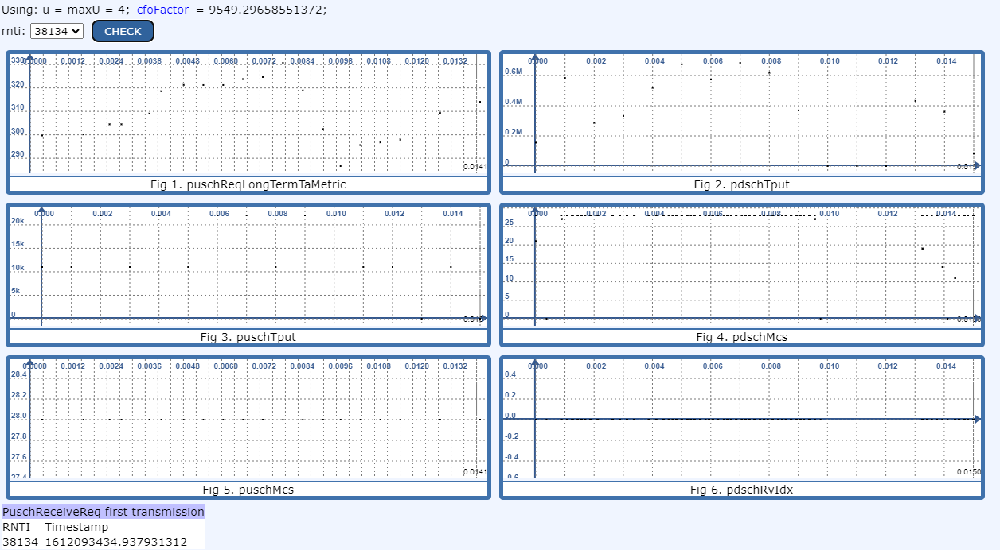

Timing analysis
----------------------

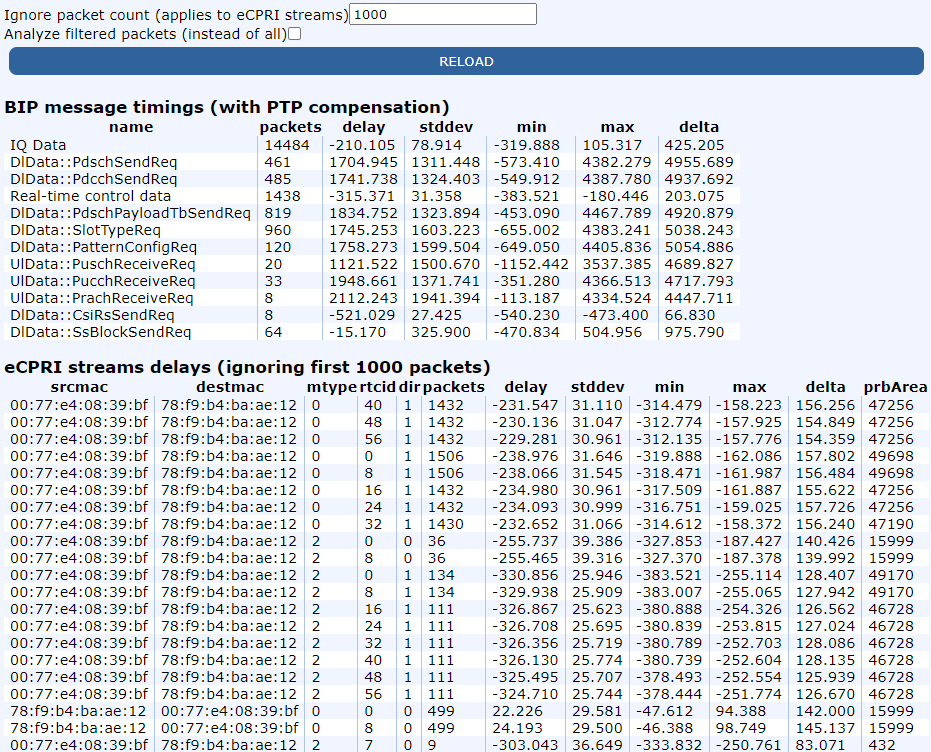

Check eCPRI pattern
----------------------

Detects overlapping eCPRI C-Plane section types in symbols.\
Legend:\
U - UpLink SectionType 1,\
D - DownLink SectionType 1,\
R - UpLink SectionType =/= 1,\
B - DownLink SectionType =/= 1,\
! - Collision (Clicking on this symboll will display affected packets in the table)

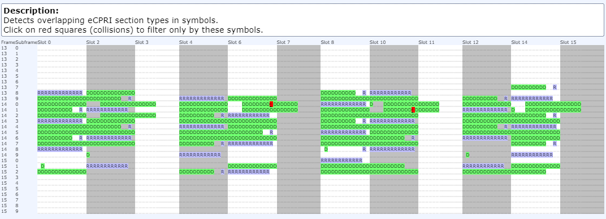

.. _proto-plat-analysis:
Proto Plat job detection
-------------------------

Analysis dedicated for C2C debugging in PPaaS.
Analysis features:

- detects jobs with their start and end times

- calculates the duration of each job

- displays FIFOs configuration

- checks if exact amount of data has been send

- allows RX, TX stream data download

- detects and marks errors in jobs

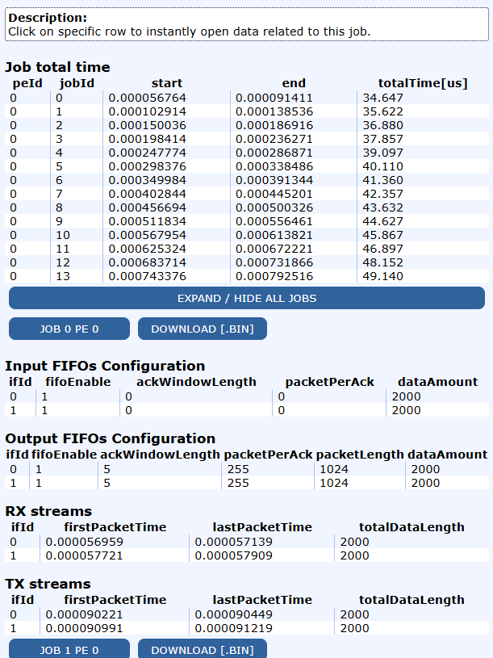

Find best sample shift
-----------------------

Analyze cyclic prefixes in order to find the best sample shift (it may take a while).

Deep L2L1 + eCPRI inspector
-----------------------------

Deeply verify L2L1+eCPRI correctness. It adds column "error" at the end of the "Packets" table.

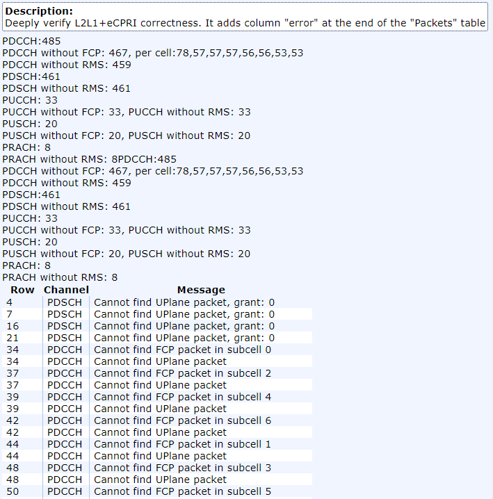

.. _pdp-prach-analysis:
PDP Prach
----------------------

Analysis dedicated for PRACH in PPaaS. It draws all PDP PRACH root plots per job and allows to select / deselect desired roots by clicking on markings e.g. "Root 1".

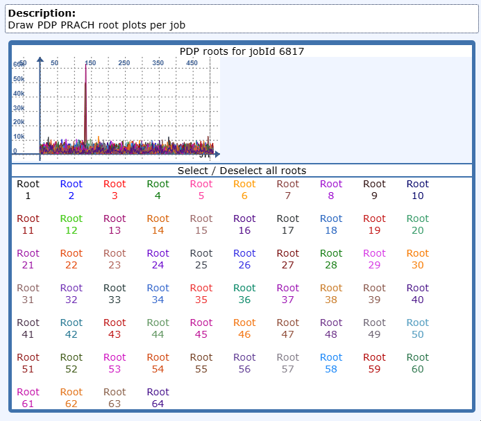

.. _hac-rx-analysis:
HAC-RX
----------------------

Analysis dedicated for HAC-RX.
Analysis features:

- detects jobs with their start and end times but to identify job it uses hacrx.taskId instead of jobId

- calculates the duration of each job

- displays task descriptor parameters per job

- allows yB, DMRS, Rdd, X_soft, Beta payload download

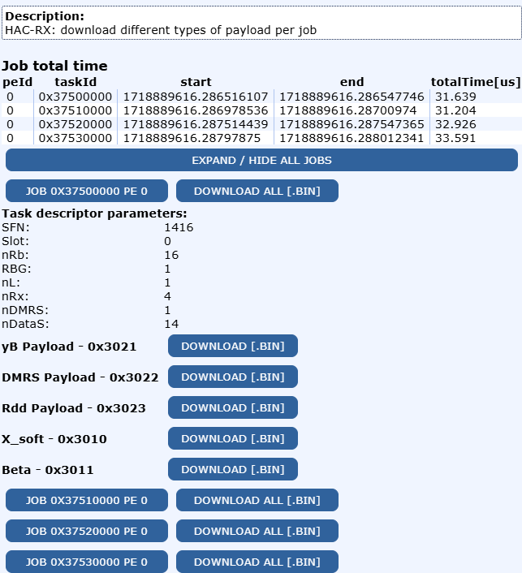