Configure
===========

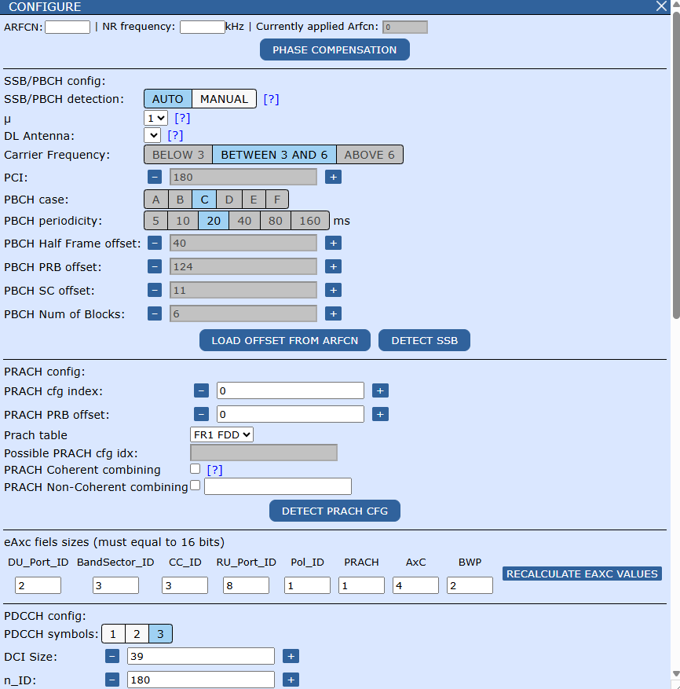

Arfcn section
-----------------------

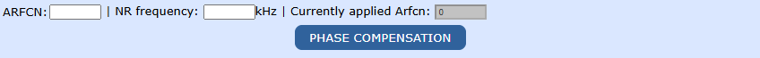

If you've loaded a **NON-PCAP** file, e.g **Binary**, IQ's constellation might appear rotated or distorted.
You can input **NR-ARFCN** value in the **ARFCN** textbox or corresponding frequency into the other textbox.
After clicking **PHASE COMPENSATION** button, changes will be applied. You can undo this by using 0 as **ARFCN**.

Below you can see **SSB** IQ before and after applying **PHASE COMPENSATION**.

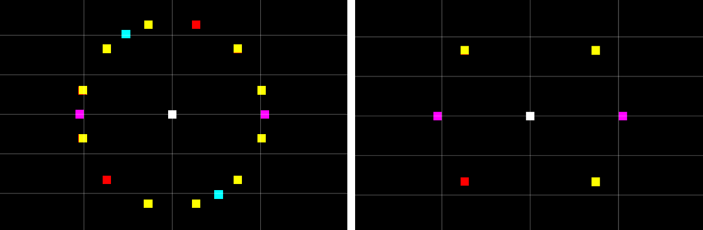

SSB/PBCH section
-----------------------

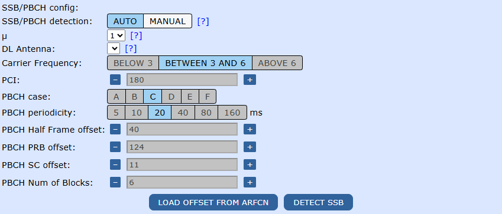

**BBA** can visualize **SSBs** on a single antenna at a time.
Easiest way to do this is to:

1.Set **SSB/PBCH detection** to **AUTO**.

2.Select proper **µ** if your capture contains antennas with different **SCS**.

3.Select antenna from the list for which you want to visualize SSBs. If the list is empty, make sure you selected correct **µ** and that your capture contains DL antennas.

4.Hit **DETECT SSB**.

If BBA fails to detect **SSBs** - all greyed-out fields will be set to 0. Otherwise you should be able to see **SSBs** in **Resource Grid** on chosen antenna.
If BBA shows incorrect **PCI**, it indicates problem with **SSB** decoding and might be caused by incorrect **ARFCN** application.

You can also set **SSB/PBCH detection** to **MANUAL** and tweak all the settings on your own.

Below you can see **SSBs** in **Resource Grid** view after detection

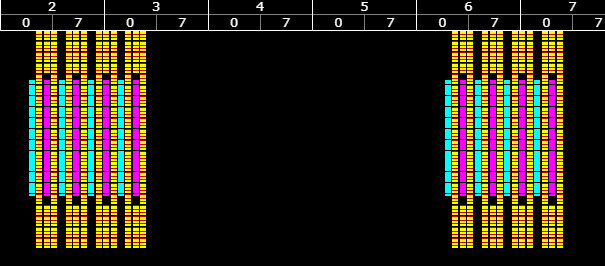

You can double-click on **SSB** to decode it. If any of shown correlations is below 0.9 or **CRC** bitmask contains some bits of value 1, this indicates problem with decoding
and might be caused by incorrect **ARFCN** application or incorrect file loading parameters. These problems are extremely rare for **PCAP** files.

Watch our tutorial video: `SSB auto-detecion <https://engage.cloud.microsoft/main/org/nokia.com/threads/eyJfdHlwZSI6IlRocmVhZCIsImlkIjoiMjk1Nzc5Mjk5NDAzMzY2NCJ9?trk_copy_link=V2>`_

PRACH section
-----------------------

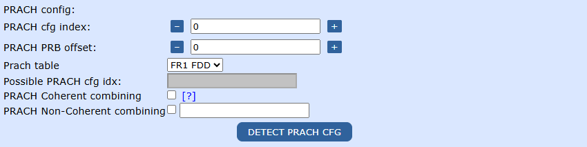

This section is related to **PRACH** configuration index detection and **PRACH** decoding.

BBA supports one configuration index per file.

To detect cfg index, all you have to do is to click **DETECT PRACH CFG**.

You will see the most probable cfg index for you file as well as other possible indexes.
In the textbox by **PRACH Non-Coherent combining** you will see tuples **(µ,antenna)**, on which BBA has located **PRACH** IQ.

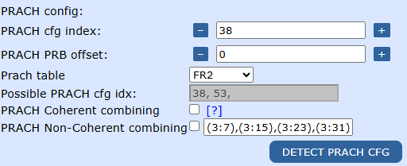

In this panel, you can also enable **PRACH** coherent and non-coherent combining steps for **PRACH** decoding.

To decode **PRACH**, you have to double click **PRACH IQ** in **Resource Grid**.
BBA will show you U-roots and logical indexes of found peaks as well as the graphs.

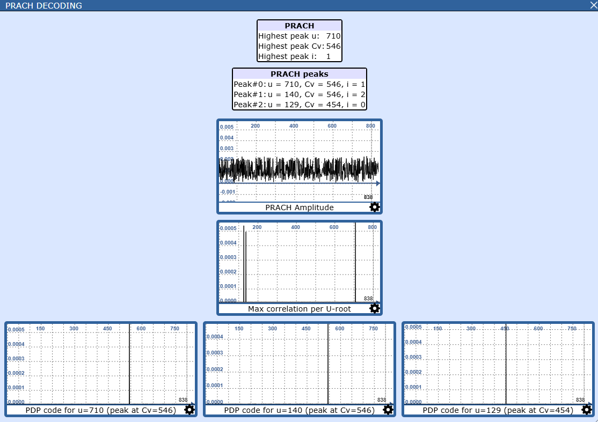

If no peaks are found, the dialog window will look like the one on the picture below.

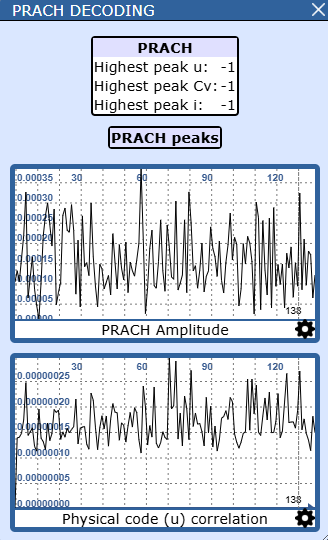

eAxc fields sizes section
-----------------------

PDCCH section
-----------------------

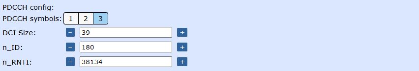

This section is intended for **PDCCH** decoding.
BBA marks first n symbols within slot as PDCCH based on **PDCCH symbols** option.

Fill the 3 textboxes with proper values and double click on **PDCCH** IQ in **Resource Grid** to decode it.

For example, to decode **PDCCH** that carries **DCI** scrambled by **SI-RNTI** you should:

1.Set **DCI Size** to 39 (most cases) or 37.

2.Set **n_ID** equal to **PCI**.

3.Set **n_RNTI** to 65535 (**SI-RNTI**).

4.Double click on **PDCCH** IQ

Example result looks like this:

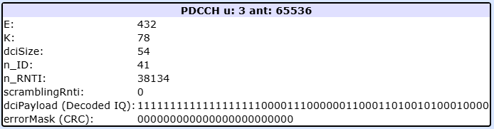

If **errorMask (CRC)** contains non-zero values, that indicates problem with decoding and might be caused by improper values in textboxes.
If you've configured **DCI** decoding in **DCI** section, you will also see dissected **DCI** fields.

DCI section
-----------------------

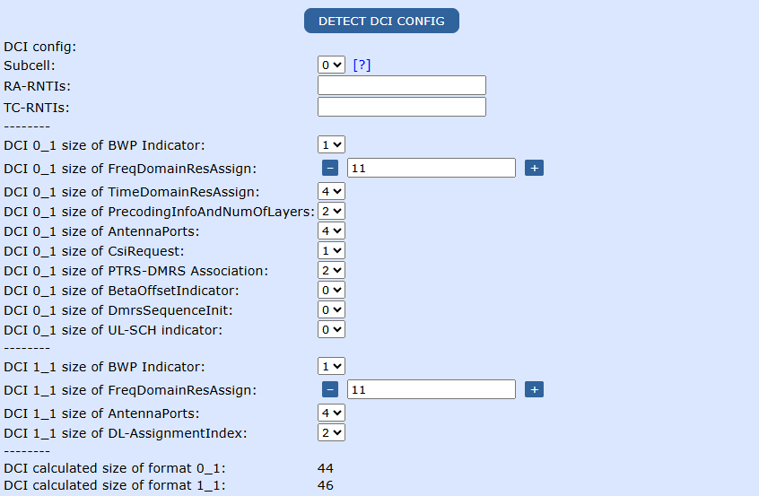

This section is intended for setting up the **DCI** decoder.
**DCI** decoding is triggered by **PDCCH** IQ decoding described in previous section or by clicking **DECODE DCI** button in **PACKET DETAILS** dialog when
inspecting **BIP** packet with **PdcchSendReq** message.

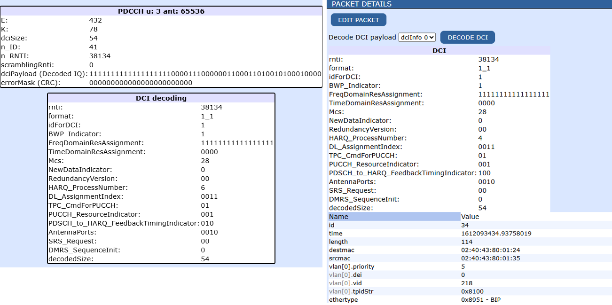

If you're capture contains **BIP** packets with messages like **PdcchSendReq**, **PdschSendReq** and **PuschReceiveReq**, you can select subcell for which BBA should perform autodetection
and click **DETECT DCI CONFIG** button. BBA will show you list of detected **RA-RNTIs** and **TC-RNTIs** as well as sizes of **DCI** fields.

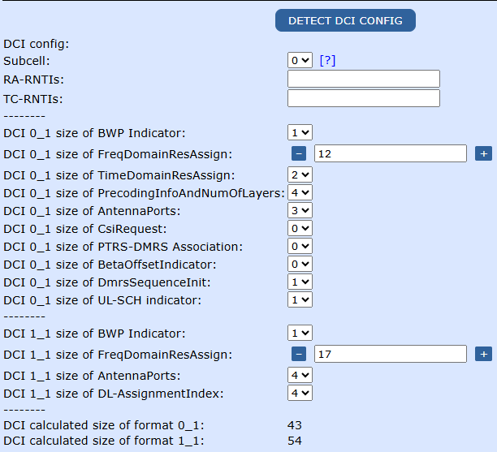

If the fields remain blank that indicates an error and might be caused by:

1.No **BIP** packets in loaded capture.

2.Mismatched subcell field (No **BIP** packets with **Subcell** field equal to this value) .

3.No **BIP** packets with **PdcchSendReq** or (**PdschSendReq** and **PuschReceiveReq**) messages

4.No **BIP** packets with **PdcchSendReq** that carry **DCI** formats **0_1** or **1_1**.

Another way to acquire **DCI** config is to click on **PdschPayloadSendReq** **BIP** packet that carries **MSG4** payload and click **DECODE PDSCH** button on top of **PACKET DETAILS** dialog.

**Tip**: Those particular **PdschPayloadSendReq** packets can be located with help of **BIP** packets with message **PdschSendReq** that have **rachStatus** field set to 4.

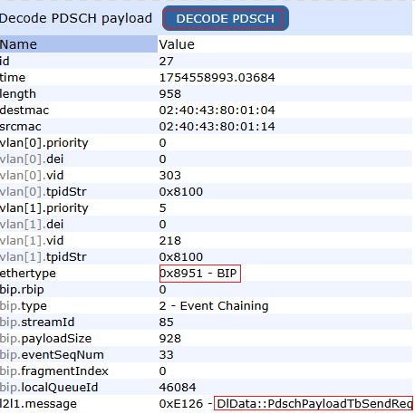

If clicking **DECODE PDSCH** results in BBA showing you message visible below, that means you've attempted to decode incorrect **PdschPayloadSendReq** packet.

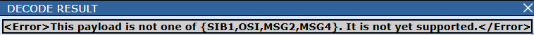

You can also manually set the **DCI** field sizes if you know the proper configuration and proceed with DCI decoding.

CSI-RS section
-----------------------

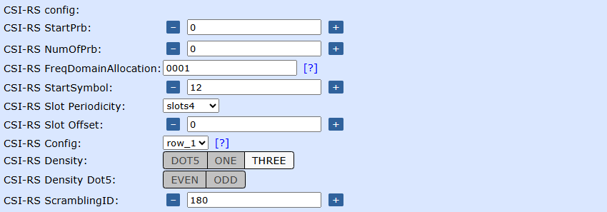

Channels from BIP packets
-----------------------

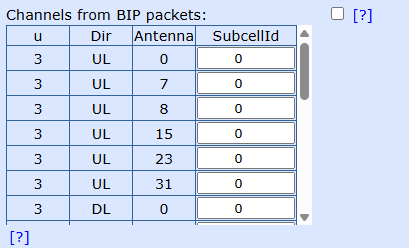

If your capture contains both **IQData** packets and **L2L1** packets such as **BIP**, **BBA** can assign NR channels/signals to IQ visible in **Resource Grid**.

The table visible in this section lists all the antennas from loaded capture and you can connect them to **BIP** packets using the subcell fields from **BIP** packets.

Example suitable capture is visible below. It contains **IQData** and **BIP** packets.

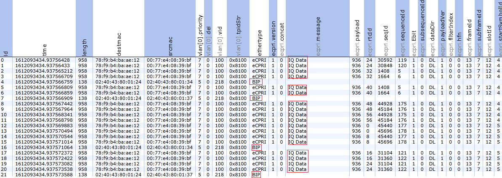

After ticking the checkbox, you should see the changes in the way BBA colors IQ in **Resource Grid**.

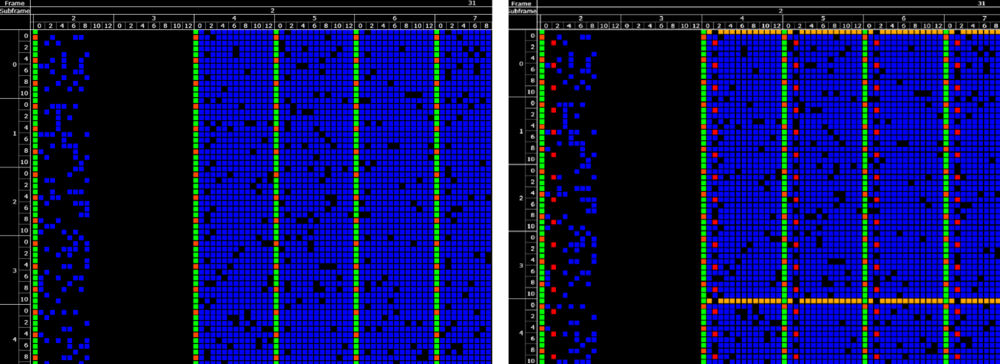

Supported channels include:
1. PDSCH DM-RS and PDSCH PT-RS
2. PDCCH and PDCCH DM-RS
3. CSI-RS
4. PUSCH DM-RS
5. PUCCH

**CSI-RS**, **PDCCH** and **DCI** sections are disabled when this mode is on and instead **BIP** packets provide all the parameters automatically.

