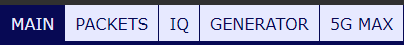
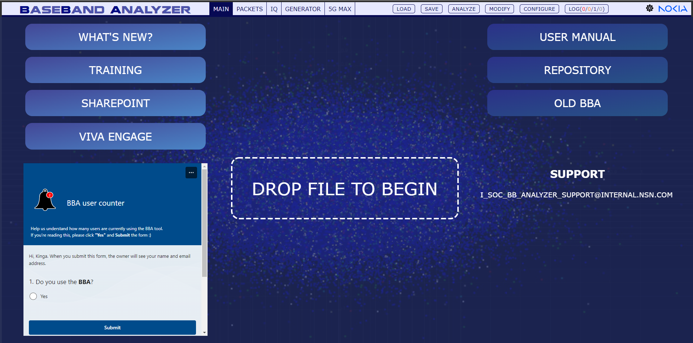
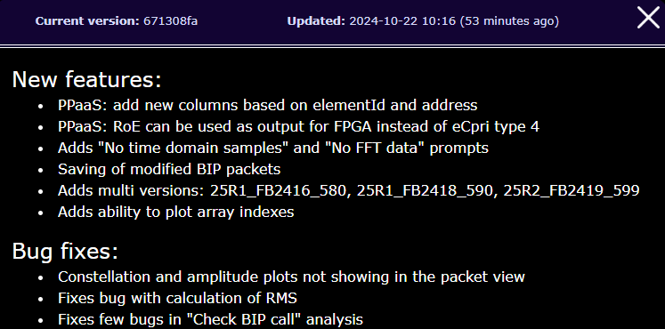
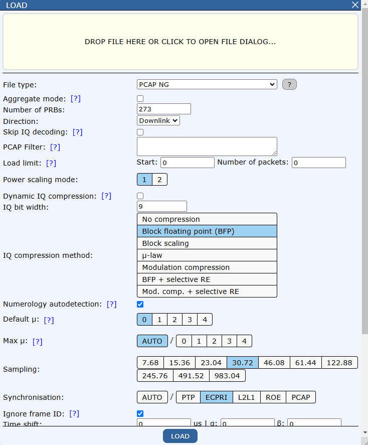

Main page
==========

What's new
-----------

Check out the latest features and bug fixes in the "What's New" dialog.

Load
------

**To start drag and drop file.​**

*Configuration for each file type can be different.*

- **File type**:

   File type autodetection​.

   .. image:: images/file_type_help.jpg
      :width: 900

- **Aggregate mode:** allow to handle multiple pcap files at the same time    ​

- **Number of PRBs:** specify the number ​

- **Direction:** Downlink/Uplink​

- **Skip IQ decoding:** Skip full IQ decoding & saving (only RMS and etc. calculations). Allow to use less memory and to load files faster but IQ samples won't be shown in Resource Grid​

- **PCAP Filter:** Load only packets matching the filter. ​

   .. code-block:: text

      Example filters:​

      @l2l1​

      @l2l1 && @l2l1.message === 0xE206​

      @ecpri​

      @ecpri && @ecpri.dataDir === 1​

      @l2l1 || @ecpri  ​

- **Load limit:** Limit number of loaded packets/samples. Set 0 to load all packets.​
      - Start - put number of packets/samples you want to skip when loading file.
      - Number of packets - put number of packets/samples you want to load after start.	

- **Power scaling mode:** Power scaling mode 1 is from ORAN. Power scaling 2 is custom solution used in Thor/Loki captures. Selecting Power scaling 2 will result in stronger signal and it will affect calculation of rms, rms_dBFS and rms_dBm. 

- **Dynamic IQ compression:** Via udCompHdr    ​

- **IQ bit width:** e.g. 9  ​

- **IQ compression method:​**

   - No compression
   - Block floating point (BFP)
   - Block scaling
   - µ-law
   - Modulation compression
   - BFP + selective RE
   - Mod. comp. + selective RE

- **Numerology autodetection:** If enabled, BBA will try to detect µ for each rtcId based on the time difference between symbols (separate per C-Plane/U-Plane and per DL/UL). In case of detection fail or if this option is disabled, the default µ will be used. 

- **Default µ:** The numerology which will be used if autodetection is disabled or in case of autodetection failure.​

   - 0 (15kHz) - FDD​

   - 1 (30kHz) - TDD FR1​

   - 2 (60kHz)​

   - 3 (120kHz) - TDD FR2​

   - 4 (240kHz) - TDD FR2 (SSB)​

- **Max µ:** If auto, max µ will be calculated as highest numerology from detected ones, else selected max µ will be used. 

- **Synchronization:** See page 3.7: Synchronization

- **ExtType11:** Weights per bundle: Number of weights per bundle. Used for decoding of eCPRI section extension type 11.    ​

- **L2L1 version autodetect:** check to autodetect​

- **L2L1 version:** or select from the drop-down list

- **Decode DCI payload while loading file** if this option is selected BBA will decode dciPayload in L2L1 packets. Decoding has two modes: AUTO and MANUAL - you can select mode in CONFIGURE dialog box. In AUTO mode BBA will try to search for corresponding PUSCH or PDSCH channels ang guess the sizes of DCI payload fields. In MANUAL mode BBA will use sizes that user selected in CONFIGURE dialog box. 

- Save and download configuration as JSON file​

- Load configuration from JSON file​

- Load PM file​

​

**After setting all the parameters click LOAD**