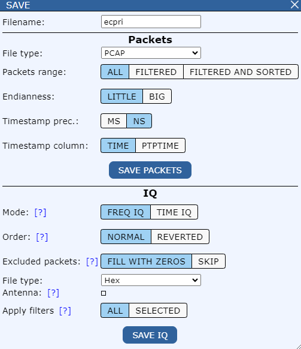

Save
-----

Save packets or iq data to a file.

Packets​
^^^^^^^^^

- **Filename:** enter a name​

- **File type:​**

    .. image:: images/save_file_type_packets.png
        :width: 200

- **Packets range:** All - save all packets, Filtered - save only filtered packets​, Filtered and sorted - save only filtered packets in the selected order

- **Endianness:** Little, Big​

- **Timestamp prec.:** MS – milliseconds, NS – nanoseconds ​

Download the file with saved packets

IQ
^^^^^^^^^

- **Filename:** enter a name​

- **Mode:** save Frequency or Time samples​. WARNING when there are no time samples in file (Time IQ view is empty) and you select TIME options resulting file will be empty. 

- **Order:** Normal: IQ, Reverted: QI​. This option reverts the order of saved samples. Normal order is (Real, Imaginary), reverted is (Imaginary, Real)

- **Excluded packets:** Fill with zeros - to fill empty and filtered places with zero amplitude samples​. If you press SKIP option BBA will save only samples with non-zero amplitude. If you want to load saved file to BBA you probably want to set this option to FILL WITH ZEROS. If FILL WITH ZEROS is selected BBA will align signal to first non-zero subframe. 

- **File type:​**

    .. image:: images/save_file_type_iq.png
        :width: 200
        

| ``HEX``: Each IQ sample is saved as number from range (0x00000000 - 0xFFFFFFFF). Each sample is in new line.
| ``Binary 16/32 bit IQ``: Each number is saved as 16/32 bit number. 
| ``Textual (for matlab)``: Each IQ saple is saved like: -0.0001220703125-0.00006103515625i
| ``Textual FXP``: Similar to format ``Textual (for matlab)`` but saved samples are integers. 
| ``C table``: Similar to ``HEX``. Saved as uint32_t type array. 
| ``5GMAX decimal exponent for eCPRI``: Each IQ saple is saved like: -0.000091552734375 -0.000091552734375
| ``IQFP``: IQFP employs a 32 bit float is in form 14+14+4b (14 bits are mantissa, 4 exponent).

- **Antenna:** Select antennas, to select multiple antennas press CTRL key    ​

- **Apply filters:** All - save all samples, Selected - save only filtered packets​

Download the file with saved IQ
