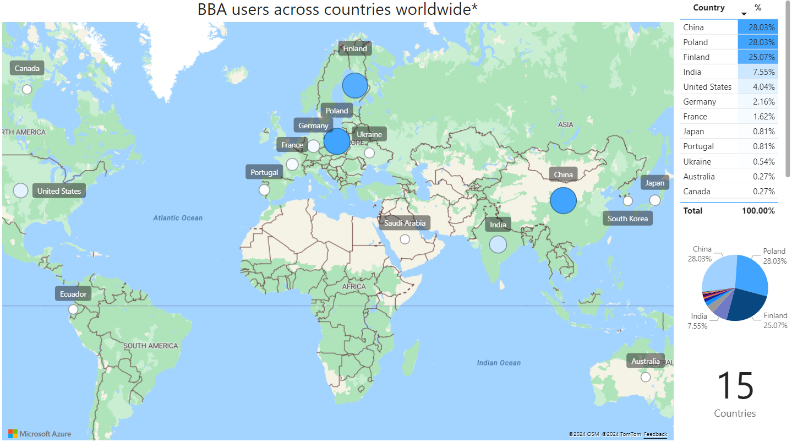
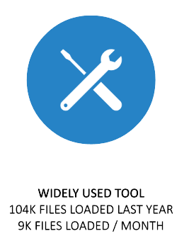

Statistics
===========

\* The data shown on the plots represents the percentage of people who either sent us an email or filled out our form confirming they are using the tool. The map is used to visualize the geographical distribution of tool usage.

Haven't filled out the form yet? You can complete it `here <https://forms.office.com/pages/responsepage.aspx?id=URdHXXWWjUKRe3D0T5YwsLW4zwJ5GRtHn7KHc_qnbuBURUNWWE9aVkhENjk4NjJIUFRFRDBDWEpXQS4u>`_ :)

.. toctree::
    :numbered:
    :maxdepth: 2
